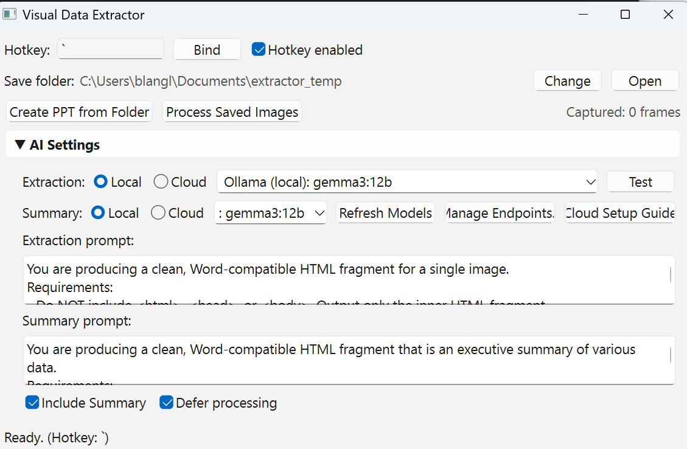

Visual Data Extractor
=====================

A Windows desktop application that captures screenshots and uses AI vision models (local Ollama or cloud Azure/OpenAI) to extract structured information from images. Produces Word-compatible HTML reports with automatic cropping, executive summaries, and flexible AI endpoint configuration.



## Key Features

### Two Operating Modes

**Mode A: Process Saved Images**
- Select image files from disk
- Choose a project folder for output
- **Cropping workflow**: Adjust crop settings before extraction
  - Preview first image with adjustable crop boundaries (top, bottom, left, right)
  - Choose: No Cropping / Apply to All / Adjust Each Image
  - Original images saved to `raw_images/` subfolder
  - Cropped images saved to main project folder
- AI extracts structured data from cropped images
- Generates Word-compatible HTML report with optional executive summary

**Mode B: Hotkey Capture**
- Global hotkey (default: `` ` ``) captures active window
- Frames queued for batch processing (if "Defer processing" enabled)
- Or process immediately after each capture
- Ideal for capturing sequences during presentations or meetings

### AI Endpoint Flexibility

**Local & Cloud Support**
- **Local**: Ollama models running on your machine
- **Cloud**: Azure AI, Azure OpenAI, or OpenAI-compatible endpoints
- **Radio button selection**: Choose Local or Cloud for extraction and summary independently
- **Test button**: Verify extraction model configuration with test image
- **Cloud Setup Guide**: Direct link to Azure AI setup documentation

### Smart Cropping

- Automatic Teams meeting detection (removes toolbars and side panels)
- Manual adjustment with live preview
- Crop all four edges: top, bottom, left, right
- Apply same crop to all images or customize per image
- Visual overlay shows what will be cropped

### User Interface

The interface (shown above) features:

1. **Top Section**: Hotkey configuration and save folder settings
2. **Action Buttons**:
   - Create PPT from Folder
   - Process Saved Images
   - Captured frame counter
3. **Collapsible AI Settings** (▼ AI Settings):
   - **Extraction model**: Local/Cloud radio + dropdown + Test button
   - **Summary model**: Local/Cloud radio + dropdown + Refresh Models + Manage Endpoints + Cloud Setup Guide
   - **Extraction prompt**: Customizable HTML generation instructions
   - **Summary prompt**: Customizable executive summary instructions
   - **Options**: Include Summary, Defer processing
4. **Status Bar**: Shows current operation and hotkey binding

## Requirements

- **Windows** (uses Windows-specific capture APIs)
- **Python 3.10+**
- **Local option**: Ollama daemon running at `http://localhost:11434`
- **Cloud option**: Azure AI or OpenAI API credentials

## Installation

1. Clone this repository:
```powershell
git clone https://github.com/bryanlan/image_data_extractor.git
cd image_data_extractor
```

2. Install dependencies:
```powershell
pip install -r requirements.txt
```

Required packages: `ollama`, `openai`, `PySide6`, `pillow`, `imagehash`, `keyboard`, `pywin32`, `numpy`

## How to Run

### Local (Ollama)
1. Start Ollama daemon
2. Pull a vision model: `ollama pull qwen3-vl:4b`
3. Run the app:
```powershell
python ollama_extractor.py
```

### Cloud (Azure/OpenAI)
1. Run the app: `python ollama_extractor.py`
2. Click **"Manage Endpoints..."** to add cloud endpoints
3. Click **"Cloud Setup Guide"** for Azure AI setup instructions
4. Select **Cloud** radio button and choose your endpoint

## Configuration

Settings are persisted to `config.json` in the app directory:

```json
{
  "extraction_model": "Ollama (local): qwen3-vl:4b",
  "summary_model": "Ollama (local): gemma3:12b",
  "endpoints": [
    {
      "name": "Ollama (local)",
      "type": "ollama",
      "url": "http://localhost:11434",
      "api_key": ""
    },
    {
      "name": "Azure GPT-4o",
      "type": "openai",
      "url": "https://your-resource.openai.azure.com/openai/deployments/gpt-4o/chat/completions?api-version=2024-05-01-preview",
      "api_key": "your-api-key"
    }
  ],
  "extraction_prompt": "...",
  "summary_prompt": "...",
  "hotkey": "`",
  "hotkey_enabled": true,
  "defer_processing": true,
  "include_summary": true
}
```

## Workflow Examples

### Processing Teams Meeting Screenshots

1. Capture screenshots during meeting (hotkey mode) or select saved images
2. App detects Teams UI and suggests crop to remove toolbar/participants
3. Adjust crop boundaries or apply to all
4. AI extracts key facts, data, and narrative from each slide
5. Executive summary consolidates themes across all slides
6. Output: Word-compatible HTML with clean formatting

### Batch Processing Documents

1. Click **"Process Saved Images"**
2. Select image files (screenshots, photos, scanned docs)
3. Choose project folder
4. Adjust crop settings
5. Select extraction model (Local: fast, Cloud: high-quality)
6. AI processes each image, extracting structured information
7. Download HTML report that opens in Microsoft Word

## Output Format

Generated HTML includes:
- **Executive Summary** (if enabled): High-level overview with highlights table
- **Per-Image Sections**:
  - **Facts**: Bullet list of key information
  - **Data**: Tables of metrics, dates, values
  - **Narrative**: Context and explanation
- **Embedded CSS**: Styles for clean Word rendering

## Troubleshooting

**App won't start**
- Verify Python dependencies installed
- For local: Check Ollama daemon running at `http://localhost:11434`
- For cloud: Verify endpoint configuration in Manage Endpoints

**Hotkey not working**
- Try running app as Administrator
- Change hotkey in settings if conflicts with other apps

**Cloud models not appearing**
- Click **Refresh Models** button
- For Azure endpoints, model name is embedded in URL (shows as endpoint name)
- Click **Test** to verify extraction model works

**Extraction fails**
- Check model supports vision (not all models handle images)
- Try smaller/faster model for large batches
- Verify API credentials for cloud endpoints

## Development

Built with:
- **PySide6**: Qt-based GUI
- **Ollama Python SDK**: Local model inference
- **OpenAI SDK**: Cloud endpoint compatibility
- **PIL/Pillow**: Image processing and cropping
- **NumPy**: Automatic crop detection

## License

MIT License - See LICENSE file for details

## Contributing

Issues and pull requests welcome at https://github.com/bryanlan/image_data_extractor
